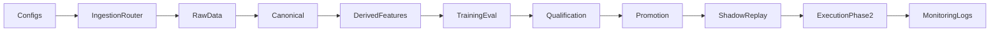
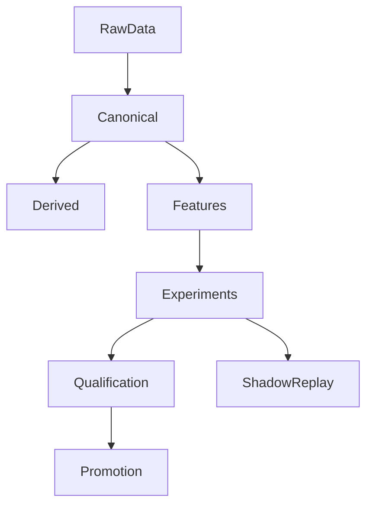
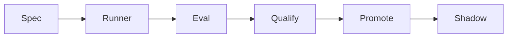

# Quanto Trading Platform

Institutional-grade, config-driven quant research and execution pipeline. Quanto
spans data ingestion, canonicalization, feature engineering, RL training, evaluation,
qualification, and (Phase 2) execution, with deterministic artifacts and auditable
manifests at every stage.

## Contents
- Overview
- Architecture
- Data and Artifact Lifecycle
- Repository Map
- Core Workflows
- Configuration
- Feature Sets
- Evaluation, Qualification, Promotion
- Execution (Phase 2)
- Use Cases
- Reproducibility and Governance
- Testing

## Overview
What this repo delivers:
- Multi-vendor ingestion across REST/flat files with deterministic manifests
- Canonical reconciliation with explicit vendor priority and lineage
- Feature sets spanning OHLCV, cross-sectional signals, and options surfaces
- RL training (PPO) and evaluation with repeatable artifacts
- Promotion/qualification gates before any shadow or execution use
- Shadow execution replay with metrics for governance evidence
- Risk-first execution design (Phase 2), enforced by policy

Core specs are embedded into this README so it can stand alone without external files.

## Architecture
Mermaid diagram of the full stack:



## Data and Artifact Lifecycle



Default data root is `.quanto_data/` (override with `QUANTO_DATA_ROOT`).

## Repository Map
Key folders and what they contain:
- `configs/`: ingestion configs, experiment specs, sweeps, and data source routing
- `infra/`: ingestion clients, pipelines, validation, canonical reconciliation
- `research/`: features, environments, evaluation, experiments, training, promotion
- `execution/`: broker adapters and risk engine (Phase 2)
- `scripts/`: CLI entry points for ingest, training, evaluation, promotion, shadow
- `tests/`: unit/integration tests
- `notebooks/`: analysis notebooks and diagnostics

## Core Workflows
End-to-end workflow (typical v1 research run):

1) Ingest raw data
```
python -m scripts.ingest \
  --config configs/ingest/polygon_equity_backfill.yml \
  --domain equity_ohlcv \
  --mode rest
```

2) Build canonical datasets
```
python -m scripts.build_canonical_datasets \
  --start-date 2022-01-01 \
  --end-date 2025-12-31
```

3) Run an experiment from a spec
```
python -m scripts.run_experiment \
  --spec configs/experiments/core_v1_regime_ppo.yml
```

4) Evaluate regime slices (if not already produced)
```
python -m scripts.run_regime_slices \
  --experiment-id <experiment_id>
```

5) Qualify and promote (governance gates)
```
python -m scripts.qualify_experiment \
  --experiment-id <candidate_id> \
  --baseline <baseline_id>

python -m scripts.promote_experiment \
  --experiment-id <candidate_id> \
  --tier candidate \
  --reason "regression + regime gates passed"
```

6) Shadow replay (deterministic, no live trading in v1)
```
python -m scripts.run_shadow \
  --experiment-id <candidate_id> \
  --replay \
  --start-date 2024-01-01 \
  --end-date 2024-12-31
```

Notes:
- API keys are read from env vars referenced in configs (example: `IVOLATILITY_API_KEY`).
- Default data root is `.quanto_data/`, override with `QUANTO_DATA_ROOT`.

## Configuration
Configs are the single source of truth. Common config types:
- Ingestion: `configs/ingest/*.yml`
- Experiment specs: `configs/experiments/*.yml`
- Sweeps: `configs/sweeps/*.yml`
- Vendor priorities: `configs/data_sources.yml`

Example experiment spec (trimmed):
```yaml
name: core_v1_regime_ppo
symbols: [AAPL, MSFT, NVDA]
start_date: "2023-01-01"
end_date: "2025-12-31"
feature_set: core_v1_regime
regime_feature_set: regime_v1
policy_params:
  policy: "MlpPolicy"
  timesteps: 200000
  reward_version: "reward_v1"
```

## Feature Sets
Feature sets are registered in `research/features/feature_registry.py`. Examples:
- `core_v1` and `core_v1_regime`
- `core_v1_xsec_regime`
- `core_v1_xsec_regime_opts_v1`
- `options_surface_v1` (same-day join)
- `options_surface_v1_lag1` (1-session lag for leakage tests)

Feature set builders read canonical data only. All joins respect trading-session
alignment and deterministic fill rules.

## Evaluation, Qualification, Promotion
Artifacts produced per experiment:
- `evaluation/metrics.json`
- `evaluation/regime_slices.json`
- `promotion/qualification_report.json`

Qualification gates combine hard safety checks (NaN/Inf, constraint violations) with
regime-sliced performance gates (drawdown and exposure protection in high-vol regimes).
Promotion records are immutable and deterministic for auditability.

Mermaid diagram of the experiment lifecycle:


## Execution (Phase 2)
Execution is bar-based and risk-first. Models output target weights; the execution
layer translates targets into orders, runs risk checks, and routes to brokers.

Key design constraints (high level summary):
- Pre-trade and post-fill risk enforcement
- Max exposure, leverage, and drawdown limits
- Deterministic, auditable order lifecycle

## Use Cases
- Quant Research: ingest data, compute features, run backtests, compare regimes
- ML/RL Engineering: train PPO policies with configurable reward shaping
- Execution/Risk: gate promotion, run shadow replay, verify risk controls
- Data Engineering: validate ingestion quality, canonicalize multi-vendor feeds

## Reproducibility and Governance
- Deterministic specs and manifests for every stage
- Canonical reconciliation with explicit vendor priority
- Promotion is gated, logged, and immutable
- Shadow replay provides execution evidence before any live path

## Testing
```
pytest -q
```
