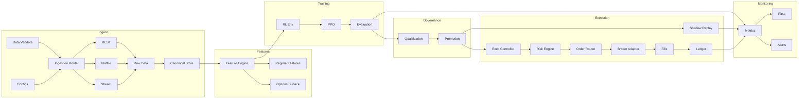
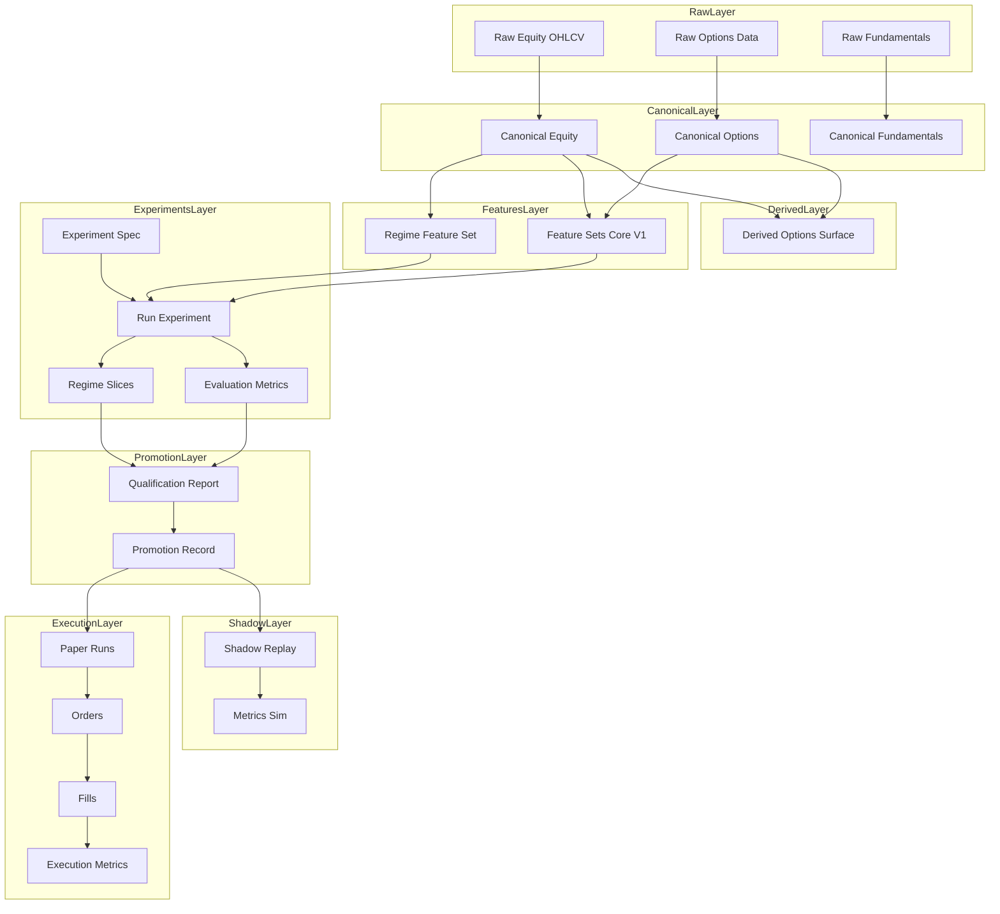
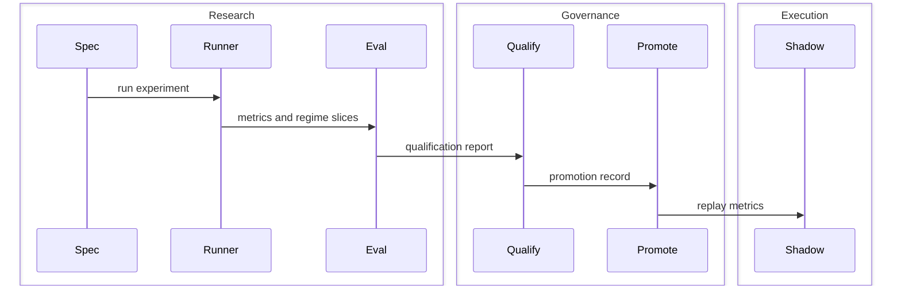

# Quanto
**Config-Driven Quantitative Research & Trading Platform**

*A modular, reproducible platform for market data ingestion, feature engineering, machine learning / reinforcement learning research, systematic evaluation, and controlled execution.*

---

## Why Quanto Exists

Quantitative research systems often break down when moving from experimentation to repeatable evaluation and production-grade workflows. Ad-hoc scripts, notebook-driven experiments, and inconsistent data handling make it difficult to trust results or compare strategies over time.

**Quanto** was built to address this gap by providing a **deterministic, end-to-end research and execution framework** that emphasizes:
- reproducibility
- explicit data lineage
- experiment governance
- clean separation between research and execution

The goal is not "black-box alpha," but **transparent, auditable ML-driven trading research**.

---

## Scope & Phases

- **Phase 1 (current):** research, backtests, qualification gates, and shadow/paper execution only.
- **Phase 2:** live execution via broker adapters (Alpaca), with strict risk controls.
- **Non-goals:** no GUI/dashboard yet, no HFT/tick-level ingestion, no AutoML.

---

## Core Capabilities

### Data Ingestion & Canonical Storage
- Multi-vendor ingestion pipelines (equities, options, derived signals)
- Deterministic manifests and canonical schemas
- Versioned raw and processed datasets to support replay and audits

### Feature Engineering & Labeling
- Modular feature pipelines for tabular and time-series data
- Consistent feature/label generation across experiments
- Explicit control of lookahead, alignment, and leakage boundaries

### ML & Reinforcement Learning Research
- Reinforcement learning research environments (FinRL-based)
- PPO policy training and reproducible evaluation
- Config-driven experiment definitions for repeatable runs

### Backtesting & Evaluation
- Automated backtesting pipelines
- Qualification gates and evaluation reports
- Artifact generation for metrics, diagnostics, and comparisons

### Execution & Risk Management
- Research / execution boundary enforced by design
- Shadow execution and deterministic replay
- Risk controls and allocation logic isolated from research code

### Monitoring & Visualization
- Structured metrics output
- Diagnostics and plotting utilities for experiment analysis
- Designed to support long-running comparative research

---

## Feature Sets & Leakage Controls

Feature sets are **versioned contracts**. For options, the default surface set is
intentionally **dense and availability-aware** (OI, volume, IVX, IVR + coverage flags),
and excludes sparse fields. When leakage is a concern, use **lagged variants**
that align options surfaces to the prior trading session.

---

## System Architecture (High Level)



This architecture is designed to keep **research, governance, and execution** cleanly separated:
- Ingestion and canonicalization build auditable, vendor‑agnostic datasets.
- Features and training operate only on canonical data.
- Qualification gates decide what is promotion‑eligible.
- Execution uses promoted artifacts only, with explicit risk controls.
- Monitoring closes the loop with metrics and diagnostics.

---

## Data and Artifact Lifecycle



This diagram is the end-to-end data story. Raw vendor data is normalized into
canonical datasets, then transformed into feature sets and experiment artifacts.
Qualification and promotion outputs are stored alongside shadow and execution
metrics so every decision can be replayed and audited.

Governance is **regime-aware**: high-volatility drawdown and exposure are enforced
as **hard gates**, while global performance (e.g., Sharpe) is treated as **soft**
evidence. Shadow replay produces deterministic execution evidence and should be
treated as a promotion prerequisite, not a tuning loop.

---

## Experiment Lifecycle



This lifecycle highlights governance: evaluation feeds regression comparison and
qualification, which gates promotion and any execution path. Shadow replay is
evidence, not optimization.

---

## Quickstart (Research Workflow)

```bash
git clone https://github.com/skyliquid22/Quanto
cd Quanto
pip install -r requirements.txt
```

Environment prerequisites (set only what you use):
```bash
export POLYGON_API_KEY=...
export IVOLATILITY_API_KEY=...
```

### CLI Wrapper (Typer)

```bash
export PYTHON=/usr/bin/python3
pip install -r requirements.txt
quanto --help
quanto
python -m cli.app
```

Minimal interactive example:
```bash
quanto
doctor
ingest -h
```

- **Ingest historical equity data (raw layer).**
```bash
python -m scripts.ingest \
  --config configs/ingest/polygon_equity_backfill.yml \
  --domain equity_ohlcv \
  --mode rest
```
Output: raw Parquet + manifest under `.quanto_data/raw/polygon/equity_ohlcv/`.

- **Reconcile vendors into canonical datasets.**
```bash
python -m scripts.build_canonical_datasets \
  --start-date 2022-01-01 \
  --end-date 2025-12-31
```
Output: canonical Parquet under `.quanto_data/canonical/equity_ohlcv/`.

- **Run a PPO experiment from a spec.**
```bash
python -m scripts.run_experiment \
  --spec configs/experiments/core_v1_regime_slices_ppo.json
```
Output: experiment artifacts under `.quanto_data/experiments/<EXPERIMENT_ID>/`.

- **Compute regime-sliced metrics for governance decisions.**
```bash
python -m scripts.run_regime_slices --experiment-id <EXPERIMENT_ID>
```
Output: `evaluation/regime_slices.json` inside the experiment folder.

- **Qualify and promote (gated by hard/soft criteria).**
```bash
python -m scripts.qualify_experiment \
  --experiment-id <EXPERIMENT_ID> \
  --baseline <BASELINE_ID>
```
```bash
python -m scripts.promote_experiment \
  --experiment-id <EXPERIMENT_ID> \
  --tier candidate \
  --reason "passes gates"
```
Output: `promotion/qualification_report.json` and promotion records.

- **Shadow replay for deterministic execution evidence.**
```bash
python -m scripts.run_shadow \
  --experiment-id <EXPERIMENT_ID> \
  --replay \
  --start-date 2024-01-01 \
  --end-date 2024-12-31
```
Output: replay artifacts under `.quanto_data/shadow/<EXPERIMENT_ID>/`.

- **Data health report (coverage + NaN diagnostics).**
```bash
python -m scripts.report_data_health \
  --domain equity_ohlcv \
  --symbols AAPL MSFT NVDA \
  --start-date 2022-01-01 \
  --end-date 2025-12-31 \
  --feature-set core_v1_regime
```
Output: JSON reports under `.quanto_data/monitoring/data_health/<run_id>/`.

All experiments are driven by **explicit configuration files**, not ad-hoc scripts.

Output locations (default under `.quanto_data/`):
- `experiments/<EXPERIMENT_ID>/evaluation/metrics.json`
- `experiments/<EXPERIMENT_ID>/evaluation/regime_slices.json`
- `experiments/<EXPERIMENT_ID>/promotion/qualification_report.json`
- `promotions/<tier>/<EXPERIMENT_ID>.json`
- `shadow/<EXPERIMENT_ID>/<replay_id>/metrics_sim.json`

---

## Data Health Checks

Use the health reporter for deterministic coverage and NaN diagnostics:
- **Calendar modes:** `union`, `intersection`, or `symbol` (data-derived, no external calendars).
- **Strict mode:** fail fast when missing or NaN thresholds are exceeded.
- **Outputs:** canonical and feature summaries under `.quanto_data/monitoring/data_health/<run_id>/`.

---

## Troubleshooting (Common Issues)

- **Missing canonical shards:** run `scripts.build_canonical_datasets` with the correct date range and verify raw inputs exist.
- **NaN-heavy features:** check coverage flags and consider lagged variants for leakage checks.
- **Qualification skips:** ensure baseline and candidate artifacts exist, then re-run `scripts.qualify_experiment`.
- **Shadow replay gaps:** confirm the experiment was promoted and replay window has data coverage.

---

## Design Principles

- **Reproducibility First**  
  Every experiment can be replayed using stored manifests and configs.

- **Research ≠ Execution**  
  Clear boundaries prevent research shortcuts from leaking into execution logic.

- **Config-Driven Control**  
  Pipelines are parameterized and versioned, enabling safe iteration.

- **Auditability Over Convenience**  
  Favor traceability and clarity over opaque automation.

---

## Testing & Quality

- Unit and integration tests for core components
- Explicit validation steps for data schemas and experiment outputs
- Structured logging and artifact storage to support debugging and review

---

## Project Status

Quanto is an **active research and engineering project** used to explore systematic ML-driven trading workflows. Some components are production-hardened, while others are research-oriented by design.

The platform prioritizes **clarity, correctness, and extensibility** over short-term optimization.

---

## Who This Is For

- ML engineers interested in **end-to-end applied systems**
- Quantitative researchers who value **reproducibility and evaluation rigor**
- Engineers exploring **ML/RL workflows beyond notebooks**
