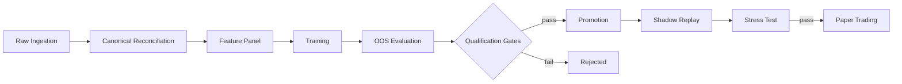
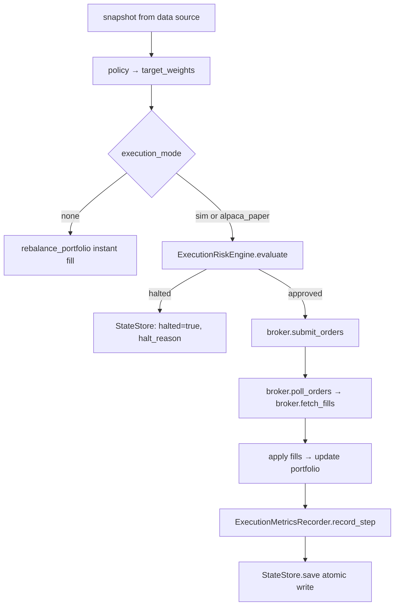
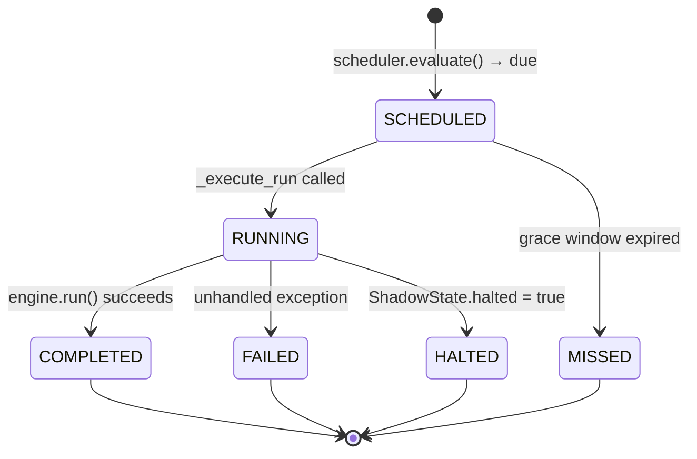

# Architecture Deep Dive

> **Audience:** Engineers working on or integrating with Quanto.  
> **Scope:** End-to-end pipeline from raw ingestion through live paper trading, covering every subsystem, data contract, state machine, and enforcement layer in the current codebase.

---

## 1. System Invariants

These are non-negotiable properties enforced by the code, not by convention.

| Invariant | What enforces it |
|---|---|
| **Deterministic experiment IDs** | `ExperimentSpec.experiment_id` is a SHA-256 digest of the canonical spec JSON (symbols, feature_set, policy_params, interval, cost_config). The same spec always produces the same ID. |
| **Promotion gate before execution** | `ShadowEngine._validate_promotion()` calls `is_experiment_promoted()` on every construction. An un-promoted experiment cannot run unless it holds a baseline allowlist entry and `replay_mode=True`. |
| **OOS-only metrics** | Evaluation windows are declared in the experiment spec and enforced by the runner; training data never bleeds into the evaluation split. |
| **Risk-first order flow** | `ExecutionRiskEngine.evaluate()` runs before every broker submission. A halted risk result short-circuits the entire step; no orders reach the broker. |
| **Atomic state writes** | `StateStore.save()` writes to a `.tmp` file then `rename()`s it — a crash mid-write leaves the previous good state intact. |
| **Immutable promotion records** | Promotion records are written once to `.quanto_data/promotion/<label>/<experiment_id>.json` and never overwritten. |
| **Config snapshot in every run** | `PaperRunner.__init__` and experiment runners write the resolved config to `run_config.json` inside the run directory before any execution starts. |

---

## 2. Canonical Directory Layout

```
.quanto_data/
├── raw/
│   └── <vendor>/
│       └── <domain>/          # e.g. polygon/equity_ohlcv, polygon/options
├── canonical/
│   └── equity_ohlcv/
│       └── <SYMBOL>/daily/<YEAR>.parquet
├── experiments/
│   └── <experiment_id>/
│       ├── spec.json
│       ├── metrics.json        # required by ExperimentRegistry.get()
│       └── runs/
│           └── training/
│               ├── run_config.json
│               ├── logs/steps.jsonl
│               └── evaluation/
│                   ├── metrics.json
│                   ├── timeseries.json
│                   └── regime_slices.json
├── promotion/
│   └── <label>/
│       └── <experiment_id>.json
├── shadow/
│   └── <experiment_id>/
│       └── <run_id>/
│           ├── state/state.json
│           ├── logs/steps.jsonl
│           └── execution_metrics.json
└── paper/
    └── <experiment_id>/
        └── runs/
            └── <run_id>/
                ├── run_config.json
                ├── state/state.json
                ├── logs/steps.jsonl
                ├── execution_metrics.json
                └── summaries/
                    └── <YYYYMMDD>.json
```

All paths are anchored to `get_data_root()` (`infra/paths.py`), which resolves `QUANTO_DATA_ROOT` env var or defaults to `<repo_root>/.quanto_data`.

---

## 3. Pipeline Overview



**Data contracts crossing each boundary:**

| Boundary | Format | Key schema |
|---|---|---|
| Raw → Canonical | Parquet shards | `timestamp`, `open`, `high`, `low`, `close`, `volume` |
| Canonical → Feature panel | In-memory `pd.DataFrame` | `timestamp` + observation columns defined by `feature_set` |
| Feature panel → Training | `UniverseFeaturePanel.rows` | Dict per timestamp: `{symbol: {col: float}}` + `regime_state` |
| Training → Evaluation | Checkpoint + `spec.json` | Policy weights + `ExperimentSpec` |
| Evaluation → Qualification | `metrics.json` | Sharpe, Sortino, max_drawdown, regime slice metrics |
| Qualification → Promotion | `promotion/<label>/<eid>.json` | Gate results + delta report |
| Promotion → Shadow | Experiment ID lookup | `ExperimentRegistry.resolve_with_spec()` |
| Shadow → Paper | `StateStore` (state.json) | `ShadowState` (portfolio, step counter, open orders) |

---

## 4. Experiment Identity

An experiment is identified by a SHA-256 digest derived from its canonical spec:

```python
# research/experiments/spec.py  ExperimentSpec.experiment_id (property)
serialized = json.dumps(spec.to_dict(), sort_keys=True)
digest = hashlib.sha256(serialized.encode()).hexdigest()
experiment_id = f"exp_{digest[:16]}"
```

Fields that participate in the digest: `symbols`, `interval`, `feature_set`, `regime_feature_set`, `policy_params`, `cost_config`, `hierarchy_enabled`.

Fields that do **not** participate: run metadata, timestamps, comments.

`ExperimentRegistry.get(experiment_id)` requires both `spec.json` and `metrics.json` to exist under `.quanto_data/experiments/<eid>/` — absence of either raises `FileNotFoundError` and blocks all downstream operations.

---

## 5. Stage Deep Dives

### 5.1 Raw Ingestion

**Entry point:** `scripts/ingest_equity_ohlcv.py`, `scripts/ingest_options_contracts.py`, `scripts/ingest_fundamentals.py`  
**CLI:** `quanto ingest --domain equity_ohlcv --config <path> --run-id <id>`

**What it does:**  
Vendor adapters under `infra/ingestion/adapters/` pull OHLCV bars, options chains, or fundamentals. The routing engine (`infra/ingestion/router.py`) selects REST vs flat-file mode based on the config `mode: auto|rest|flat_file` field.

**Outputs:**
```
.quanto_data/raw/<vendor>/<domain>/<symbol>/<YEAR>.parquet
.quanto_data/raw/<vendor>/<domain>/manifests/<run_id>.json
```

**Config keys** (`configs/ingest/*.yml`):
- `symbols` — list of tickers
- `start_date`, `end_date` — ISO date strings (must be quoted)
- `mode` — `auto | rest | flat_file`
- `run_id` — deterministic identifier threaded into manifest

**What breaks and why:**
- Missing `POLYGON_API_KEY` → adapter raises `RuntimeError` before any fetch
- Vendor outage → HTTP 5xx surfaced as exception; manifest not written; run is safe to retry
- Schema validation failure → shard not written; manifest records the gap

---

### 5.2 Canonical Reconciliation

**Entry point:** `scripts/build_canonical.py`  
**CLI:** `quanto build-canonical --config <path>`

**What it does:**  
`infra/ingestion/` merges raw shards from one or more vendors using priority ordering defined in `configs/data_sources.yml`. Deduplication, gap-filling, and validation gates run per symbol per year.

**Outputs:**
```
.quanto_data/canonical/equity_ohlcv/<SYMBOL>/daily/<YEAR>.parquet
```

Schema: UTC-indexed `timestamp`, `open`, `high`, `low`, `close`, `volume` — all float64 except `volume` (int64).

**What breaks and why:**
- Missing raw input for a requested year → validation gate fails; canonical shard not written
- Zero-volume bars not filtered by default; downstream features handle them via forward-fill

---

### 5.3 Feature Panel Construction

**Implementation:** `research/features/feature_registry.py`  
**Key functions:** `build_features()`, `build_universe_feature_panel()`

**What it does:**  
`build_features(feature_set, equity_df, ...)` dispatches to the registered builder for the named feature set, producing a `FeatureSetResult` with a typed `frame` and fixed `observation_columns` tuple.

`build_universe_feature_panel(feature_results, ...)` aligns multiple per-symbol frames onto a union calendar, applies forward-fill (limit=3), computes regime features, and returns a `UniverseFeaturePanel`.

**Registered feature sets** (from `_FEATURE_REGISTRY`):
- `core_v1` — OHLCV primitives, SMA crossover, momentum
- `equity_xsec_v1` — cross-sectional factors (log_mkt_cap, mom_12m_excl_1m, mom_3m)
- `options_surface_v1` / `options_surface_v1_lag1` — IV surface, term structure, skew
- `insiders_v1` — insider transaction features

**Regime feature sets:**
- `regime_v1` — per-universe vol bucketing (high / mid / low) via q33/q66 quantiles
- `regime_v1_1` — primary regime universe (fixed ticker list in `research/regime/universe.py`), loaded from canonical parquet rather than from the experiment's universe

**Observation columns are strictly ordered.** Base feature columns come first; regime columns are appended as a suffix. `ShadowEngine` splits them at `len(base_columns)` to separate policy inputs from regime inputs.

**What breaks and why:**
- Feature set name not in registry → `ValueError` from `normalize_feature_set_name()`
- `close` column missing → `build_universe_feature_panel` raises before alignment
- Fewer than 2 valid timestamps after alignment → raises; minimum viable panel requires 2 rows

---

### 5.4 Training

**Entry point:** `scripts/run_experiment.py`, `scripts/train_ppo_weight_agent.py`, `scripts/train_sac_weight_agent.py`  
**CLI:** `quanto run-experiment --config <path>`

**What it does:**  
Loads the experiment spec, builds the feature panel, constructs a `SignalWeightTradingEnv`, and runs a PPO or SAC training loop. Checkpoints + metadata are written under `runs/training/`.

**Experiment spec YAML keys:**

```yaml
experiment_id: exp_<sha256[:16]>   # derived; do not set manually
symbols: [AAPL, MSFT, GOOGL]
interval: daily
feature_set: core_v1
regime_feature_set: regime_v1      # optional
policy_params:
  fast_window: 20
  slow_window: 50
cost_config:
  transaction_cost_bp: 5.0
hierarchy_enabled: false
```

**Required outputs before `ExperimentRegistry.get()` will accept the experiment:**
- `spec.json` — serialized `ExperimentSpec`
- `metrics.json` — top-level metrics file (written by evaluation, not training)

**What breaks and why:**
- `fast_window >= slow_window` → `_resolve_sma_config()` raises before data source is built
- `hierarchy_enabled: true` without `regime_feature_set` → `ExperimentSpec.__post_init__` raises

---

### 5.5 OOS Evaluation

**Entry point:** `scripts/evaluate_agent.py`  
**CLI:** `quanto evaluate --experiment-id <eid>`

**Outputs:**
```
.quanto_data/experiments/<eid>/runs/training/evaluation/
    metrics.json        # Sharpe, Sortino, max_drawdown, calmar, alpha, beta
    timeseries.json     # daily portfolio values
    regime_slices.json  # per-regime-bucket metrics breakdown
```

Metrics are computed exclusively on the OOS split declared in the spec. The training window never overlaps the evaluation window — this is enforced by date range slicing in the runner, not by convention.

---

### 5.6 Qualification

**Entry point:** `scripts/qualify_experiment.py`  
**CLI:** `quanto qualify --experiment-id <eid> --baseline <baseline_eid>`

**Implementation:** `research/promotion/criteria.py` — `QualificationCriteria.evaluate()`

**Gate hierarchy:**

```
Hard gates (any failure → qualification fails):
  ├── Regression gates (research/experiments/regression.py)
  │     Sharpe delta, Sortino delta, max_drawdown delta vs baseline
  ├── Max drawdown absolute threshold
  ├── Regime diagnostics hard failures
  │     High-vol Sharpe below floor
  └── Execution criteria (if shadow run exists)
        Fill rate, reject rate, slippage vs thresholds

Soft gates (failures become warnings, don't block):
  ├── Sweep robustness (param sensitivity across sweep runs)
  └── Regime diagnostics soft warnings
```

**Qualification report output:**
```
.quanto_data/promotion/<label>/qualification_<candidate_eid>.json
```

Contains: `passed`, `failed_hard`, `failed_soft`, `gate_summary`, `comparison_deltas`.

---

### 5.7 Promotion

**Entry point:** `scripts/promote_experiment.py`  
**CLI:** `quanto promote --experiment-id <eid> --tier production --reason "..."`

**What it does:**  
Writes an immutable promotion record:
```
.quanto_data/promotion/<label>/<experiment_id>.json
```

`is_experiment_promoted(experiment_id)` checks for this file's existence. Once written, `ShadowEngine` will accept the experiment for full execution (not just replay mode).

**Baseline allowlist** (`research/promotion/baseline_allowlist.py`):  
Allows an un-promoted experiment to run in shadow replay and stress test mode for pre-promotion validation. Entries are written by `scripts/baseline_allowlist.py` and checked by `ShadowEngine._validate_promotion()` when `replay_mode=True`.

---

### 5.8 Shadow Replay

**Entry point:** `scripts/run_shadow.py`  
**CLI:** `quanto run-shadow --experiment-id <eid> --start-date <date> --end-date <date>`

**Implementation:** `research/shadow/engine.py` — `ShadowEngine`

**Execution modes:**

| `execution_mode` | Broker | Fill model | Use case |
|---|---|---|---|
| `none` | None | `rebalance_portfolio()` — instant, zero-cost rebalancing | Baseline signal quality |
| `sim` | `SimBrokerAdapter` | `ExecutionSimulator` — configurable `slippage_bps`, fill confirmation | Pre-paper execution evidence |
| `alpaca_paper` | `AlpacaBrokerAdapter` | Real Alpaca paper API fills | Live paper trading |

**State machine per step:**



**Key state fields** (`research/shadow/schema.py` — `ShadowState`):

| Field | Purpose |
|---|---|
| `current_step` | Index into calendar; drives resume |
| `cash`, `holdings`, `last_weights` | Portfolio state |
| `halted`, `halt_reason` | Execution halt propagation |
| `submitted_order_ids`, `broker_order_map` | Resume-safe order tracking |
| `peak_portfolio_value` | Trailing drawdown baseline |

**Outputs:**
```
.quanto_data/shadow/<eid>/<run_id>/
    state/state.json          # ShadowState (atomic writes)
    logs/steps.jsonl          # per-step execution log
    execution_metrics.json    # ExecutionMetricsRecorder snapshot
```

---

### 5.9 Stress Testing

**Entry point:** `scripts/run_stress_test.py`  
**CLI:** `quanto run-stress-test --config <path> --experiment-id <eid>`

**Implementation:** `research/stress/runner.py` — `StressTestRunner`

**Purpose:** Pre-promotion adversarial gate — runs the policy through worst-case historical regimes and synthetic shocks before it is approved for paper trading.

**Scenario types:**

```yaml
# historical_regime: finds contiguous windows where regime matches label
scenarios:
  - name: crash_replay
    type: historical_regime
    historical_regime:
      label: crash       # alias → ["high_vol", "high_vol_trend_down"]
      min_days: 10

  # synthetic: wraps ReplayMarketDataSource with StressDataSource mutations
  - name: shock_test
    type: synthetic
    synthetic:
      mutation: shock          # shock | drift | volatility_spike
      magnitude: -0.15         # applied to all panel features multiplicatively
      inject_at: "2020-03-16"  # ISO date or day-0 approximation
```

**Gate definitions:**

```yaml
gates:
  drawdown:
    enabled: true
    thresholds:
      max_drawdown: 0.20      # peak-to-trough from logs/steps.jsonl
  var_limit:
    enabled: true
    thresholds:
      confidence: 0.95
      max_loss: 0.05          # historical VaR at 95th percentile
  liquidity:
    enabled: true
    thresholds:
      min_daily_volume: 50000 # avg fill notional floor
```

**Gate evaluation** (`research/stress/gates.py` — `StressGateEvaluator`):  
Reads `run_dir/logs/steps.jsonl` after each scenario run. Returns `GateResult` with `status: pass | warn | fail | skipped`. Any `fail` sets `StressTestResult.overall_status = "fail"`.

**Mutation fidelity note:** Mutations apply to pre-materialized features, not raw prices. SMA/vol values are not re-derived from shocked prices — this is a documented approximation acceptable for adversarial gate purposes.

---

### 5.10 Paper Trading

**Entry point:** `scripts/run_paper_scheduled.py`  
**CLI:** `quanto run-paper-scheduled --config <path>`

**Implementation:** `research/ops/service.py` — `PaperRunOrchestrator`

#### Paper run lifecycle state machine



States `COMPLETED`, `HALTED`, `FAILED`, `MISSED` are terminal — `RunLifecycleTracker.is_terminal` returns true and the scheduler will not re-attempt.

#### Daily execution flow

```
PaperRunOrchestrator.run()
  │
  ├── PaperRunScheduler.evaluate()       # is a run due? any missed runs?
  ├── RunLifecycleTracker.record_transition(SCHEDULED)
  ├── RunExecutor.execute(lambda: _execute_run(...))
  │     │
  │     └── _execute_run()
  │           ├── AlpacaLiveDataSource(spec, run_start_date)
  │           │     ├── fetch 60 trading days of OHLCV bars from Alpaca
  │           │     │   SIP feed → IEX fallback on HTTP 403
  │           │     ├── build_features() → build_universe_feature_panel()
  │           │     └── calendar spans [run_start_date, today]
  │           ├── StateStore.load()      # resume from previous day's state
  │           ├── ShadowEngine(live_mode=True, execution_mode=alpaca_paper)
  │           └── engine.run(max_steps=1)   # execute today's step only
  │
  ├── emit_trace(initializer=paper_orchestrator, ...)
  ├── DailySummaryWriter.write()         # summaries/<YYYYMMDD>.json + .md
  └── AlertEmitter.emit()                # soft alert if expect_trades and turnover==0
```

#### `run_start_date` persistence

On the first invocation of a paper run, `run_start_date = scheduled_for.date()` is persisted into the lifecycle tracker's metadata dict. Subsequent invocations read it back so `AlpacaLiveDataSource` can grow its calendar by exactly one day per invocation, keeping `StateStore.current_step` consistent as an index into the calendar.

#### Paper run config keys (`configs/paper/*.yml`):

```yaml
experiment_id: exp_<sha256[:16]>
execution_mode: alpaca_paper
universe: [AAPL, MSFT, GOOGL]
broker:
  alpaca_base_url: https://paper-api.alpaca.markets   # must contain "paper"
risk_limits:
  max_gross_exposure: 1.0
  max_symbol_weight: 0.25
  max_turnover: 0.25
  max_drawdown: 0.05
  min_cash_pct: 0.10
polling:
  max_poll_seconds: 30.0
  poll_interval_seconds: 2.0
reconciliation:
  position_tolerance_shares: 0.01
  cash_tolerance_usd: 5.0
artifacts:
  output_root: .quanto_data/paper/<eid>/runs
```

**Required env vars for paper trading:** `ALPACA_API_KEY`, `ALPACA_SECRET_KEY`.

---

## 6. Execution Risk Enforcement

`ExecutionRiskEngine` (`research/execution/risk_engine.py`) runs pre-order checks on every step.

**Config resolution order** (later entries override earlier):
1. `ExecutionRiskConfig` defaults (all `None` — no limit)
2. `configs/risk.yml` loaded by `ExecutionRiskConfig.from_policy_file()`
3. Per-run `risk_overrides` passed through `execution_options` in `ShadowEngine`
4. Paper run `risk_limits` block (via `PaperRunner.build_execution_options()`)

**Hard checks enforced at order compile time:**

| Limit | Config key | What happens on breach |
|---|---|---|
| `max_gross_exposure` | `exposure.max_gross_exposure` | Orders rejected; step logged with `risk_halt` |
| `max_symbol_weight` | `position_limits.max_position_pct_nav` | Per-symbol orders reduced or rejected |
| `max_daily_turnover` | `liquidity.max_daily_turnover` | Orders rejected after turnover budget exhausted |
| `max_trailing_drawdown` | `loss_controls.max_drawdown` | Trading halt; `ShadowState.halted = True` |
| `max_daily_loss` | `loss_controls.max_daily_loss` | Trading halt |
| `max_active_positions` | `exposure.max_positions` | New position orders rejected |
| `min_cash_pct` | _(paper config)_ | Orders sized to preserve minimum cash |

A halt sets `ShadowState.halted = True` and `ShadowState.halt_reason`. On the next step, `ShadowEngine.step()` raises `RuntimeError` immediately — no further trading occurs until the state is manually reset.

---

## 7. Execution Metrics

`ExecutionMetricsRecorder` (`research/execution/metrics.py`) accumulates stats across all steps in a run.

**Snapshot fields written to `execution_metrics.json`:**

```json
{
  "summary": {
    "fill_rate": 0.97,
    "reject_rate": 0.02,
    "avg_slippage_bps": 3.4,
    "p95_slippage_bps": 8.1,
    "total_fees": 12.50,
    "turnover_realized": 0.18,
    "execution_halts": 0,
    "halt_reasons": [],
    "partial_fill_rate": 0.01
  },
  "regime": {
    "high_vol": { "fill_rate": 0.91, "avg_slippage_bps": 6.2 },
    "mid_vol":  { "fill_rate": 0.99, "avg_slippage_bps": 2.1 }
  }
}
```

The `regime` block is populated only when `regime_bucket` is passed to `record_step()` — this happens automatically in `ShadowEngine.step()` via `_regime_bucket_for_step()`.

---

## 8. Observability & Trace Lineage

### Task ledger

Every significant pipeline operation emits a JSONL record to `monitoring/logs/task_ledger.jsonl`:

```json
{
  "timestamp": "2024-01-02T10:00:00+00:00",
  "initializer": "paper_orchestrator",
  "task_title": "paper run exp_abc123",
  "run_id": "paper_def456",
  "status": "succeeded",
  "duration_s": 4.2,
  "artifacts": [".quanto_data/paper/exp_abc123/runs/paper_def456"],
  "error": null
}
```

**Emitters:**

| `initializer` | Trigger |
|---|---|
| `experiment_runner` | After `run_experiment()` completes or fails |
| `stress_runner` | Per scenario×seed combination |
| `paper_orchestrator` | Per scheduled paper run |

**CLI:** `quanto show-traces --tail 20 --status failed`

### Daily summaries

`DailySummaryWriter` (`research/paper/summary.py`) writes per-day JSON and Markdown under `runs/<run_id>/summaries/<YYYYMMDD>.{json,md}`. Contents: pnl, exposure, turnover, fees, halt_reasons, scheduled_for, completed_at.

### Lifecycle records

`RunLifecycleTracker` persists state transitions to a JSON file under the ops data directory. Each transition is timestamped and includes free-form metadata (run_dir, scheduled_for, run_start_date). Terminal state transitions are never overwritten.

---

## 9. Alpaca Broker Adapter

`AlpacaBrokerAdapter` (`research/execution/alpaca_broker.py`) implements five REST operations against `https://paper-api.alpaca.markets`:

| Method | Endpoint | Notes |
|---|---|---|
| `submit_orders` | `POST /v2/orders` | One request per order; `client_order_id` threaded through for idempotency |
| `poll_orders` | `GET /v2/orders/{broker_order_id}` | Alpaca status → internal `SUBMITTED / PARTIALLY_FILLED / FILLED / REJECTED / CANCELED` |
| `fetch_fills` | `GET /v2/orders/{broker_order_id}` | Returns `Fill` only when `filled_qty > 0`; fees are zero in paper mode |
| `get_account` | `GET /v2/account` | Returns `AccountSnapshot` (equity, cash, buying_power) |
| `get_positions` | `GET /v2/positions` | Returns `list[PositionSnapshot]` |

**Safety guard:** The adapter constructor rejects any `base_url` that does not contain the string `"paper"`, preventing accidental live trading.

**Errors:** All HTTP errors are normalized via `normalize_error()` and surfaced as `broker_errors` in `ExecutionStepResult`. Broker errors do not halt execution unless they exceed the max error threshold tracked by `ExecutionController`.

---

## 10. Config-Driven Architecture

The entire system is config-driven. No hardcoded symbols, dates, or parameters exist in production code paths.

```
configs/
├── ingest/
│   ├── equity_smoke.yml         # symbols, dates, mode
│   ├── options_smoke.yml
│   └── financialdatasets_smoke.yml
├── experiments/
│   └── core_v1_*.yml            # ExperimentSpec fields
├── sweeps/
│   └── *.yml                    # param grid for run-sweep
├── paper/
│   └── core_v1_paper.yml        # PaperRunConfig
├── ops.yml                      # OpsConfig: cron, backoff, alerts
├── data_sources.yml             # vendor priority + canonical settings
└── risk.yml                     # ExecutionRiskConfig thresholds
```

Each run writes its resolved config into the run directory (`run_config.json`) so results can be reproduced exactly from the artifact alone, without the original config file.

---

## 11. Extensibility Points

| What to extend | Where to do it |
|---|---|
| New data vendor | Add adapter under `infra/ingestion/adapters/`; register in router |
| New feature set | Register in `research/features/feature_registry.py` `_FEATURE_REGISTRY` dict with a builder function and `observation_columns` tuple |
| New regime feature set | Add to `_REGIME_FEATURE_OBSERVATION_COLUMNS` and implement `compute_regime_features()` variant |
| New policy type | Implement `_initialize_policy()` branch in `ShadowEngine` |
| New execution mode | Add branch in `ShadowEngine._initialize_execution()` and `ShadowEngine.step()` |
| New qualification gate | Add to `QualificationCriteria.evaluate()` in `research/promotion/criteria.py` |
| New stress scenario type | Add to `StressTestRunner._build_data_source()` and `StressDataSource` |
| New CLI command | Create `cli/commands/<name>.py` with a `CommandSpec`, register in `cli/commands/registry.py` |
| New trace consumer | Read `monitoring/logs/task_ledger.jsonl` — newline-delimited JSON, append-only |
